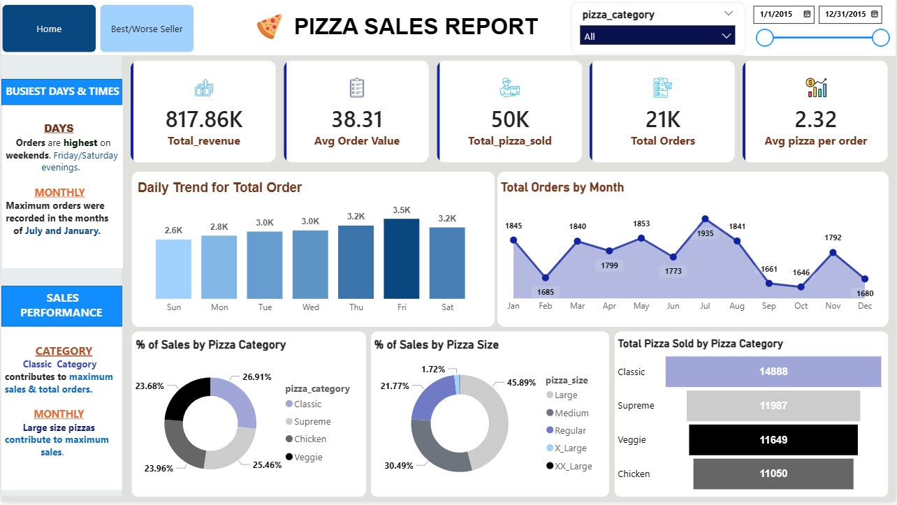

# 🍕 Pizza Sales Performance Analysis & Business Intelligence Dashboard

<p align="center">
  
</p>

<p align="center">
  <b>Turning Raw Data into Actionable Business Insights using Power BI</b>
</p>

---

## 📌 Project Overview

This project delivers a complete **Business Intelligence (BI) solution** built with **Microsoft Power BI**, focused on transforming raw transactional data into meaningful insights.

The dashboard enables stakeholders to make **data-driven decisions** across operations, marketing, and product strategy.

---

## 🎯 Objectives

✔ Analyze sales performance  
✔ Understand customer purchasing behavior  
✔ Identify top & low performing products  
✔ Optimize workforce planning  
✔ Increase revenue through insights  

---

## 🚀 Key Insights

### 🔹 Workforce Optimization
- Peak sales: **Friday & Saturday evenings**
- Helps optimize staff scheduling and reduce idle time  

---

### 🔹 Menu Engineering

| Category         | Product              |
|-----------------|----------------------|
| 🏆 Top Seller    | Thai Chicken Pizza   |
| ⚠️ Low Performer | Brie Carre Pizza     |

➡ Supports better pricing & menu strategy  

---

### 🔹 Revenue Growth
- Calculated **Average Order Value (AOV)**
- Identified:
  - Upselling opportunities  
  - Bundle/combo strategies  

---

### 🔹 Seasonal Trends
- Detected sales spikes  
- Helps in:
  - Marketing planning  
  - Inventory management  

---

## 🛠️ Tech Stack

- **Power BI Desktop**
- **Power Query (ETL)**
- **DAX (Data Analysis Expressions)**
- **Data Modeling (Star Schema)**

---

## 📂 Project Structure

```bash
Pizza-Sales-Performance-Analysis/
│
├── Image/
│   ├── Dashboard.png
│   └── Dashboard_2.png
│
├── Pizza_Sales.xlsx
├── Pizza_Sales_Report.pbix
├── LICENSE
└── README.md
```

---

## 🚀 How to View the Dashboard

### 🌐 Live Interactive Dashboard (Recommended)
Experience the dashboard instantly in your browser — no installation required:

👉 **[View Live Dashboard](https://tinyurl.com/4npsy6za)**

✔ Fully interactive  
✔ Works on any device  
✔ Best way to explore insights  

---
## 💻 Run Locally (Power BI Desktop)

### 📥 Step 1: Clone the Repository
```bash
git clone https://github.com/shawon-analyst/Pizza-Sales-Performance-Analysis.git

This project is part of a professional portfolio showcasing:

End-to-end data analytics workflow
Data transformation & modeling
Business insight generation using Power BI
```
---

### 👤 Author
**Shawon** | Data Analyst  
🔗 [LinkedIn Profile](https://www.linkedin.com/in/shawonanalyst/)  
🌐 [Portfolio Website](https://shawon-analyst-portfolio.vercel.app)

---
*Note: This project is part of a professional portfolio demonstrating end-to-end data analytics and business strategy skills.*
